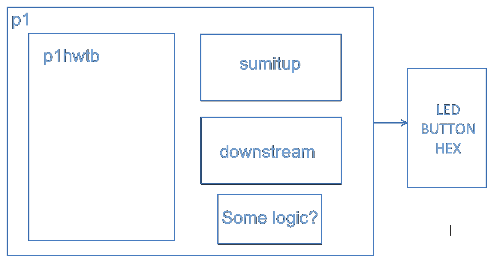

# LAB 1 - EE4449 - HCMUT

# Warmup

## Objective and Overview

The purpose of this project is to brush off any dust that has accumulated on
your SystemVerilog skills.  It's as much about getting an FPGA programming
environment set up as anything else.  As such, this project is significantly
simpler than any other course project; and, therefore, worth far fewer points.

This is an **group** project, to be done in simulation with MODELSIM/QUESTASIM OR VSIM and on Quartus for
your Altera DE10 board. Please tick on optimization with full visibility on QuestaSim.

## A Note about Collaboration

Project 1 is to be accomplished in a group.  All work must be your own.

Hints from others can be of great help, both to the hinter and the hintee.
Thus, discussions and hints about the assignment are encouraged.  However, the
project must be coded and written up in a group (you may not show, nor view,
any source code from other students).  We may use automated tools to detect
copying.

Use Emails/BKEL to ask questions or come visit us (203B3) during office hours.  
We want to see you succeed, but you have to ask for help.

## Background

Over the semester we’ll do several assignments (homeworks and/or
projects) that are to be implemented and demonstrated on the Altera DE10
boards at the lab.  The kit you’ll use
contains the board, power supply, and a USB A to USB B cable.

The basic idea here is to install the software on
your computer, run it to develop the system described here, and turn
your code in, all before the due date. 

The software is available for Windows and Linux.  Install it from the
DVD or download it at http://fpgasoftware.intel.com.  The latest version
of Quartus will work, but remember to install the Cyclone V library when prompted.

If you have a Mac (lucky you), you will have to 
use a virtual machine (Parallels, VMware, etc).

People will
probably need to do something with the USB Blaster windows driver (if you have never used the kit before), which
is available at: http://www.terasic.com.tw/wiki/Altera_USB_Blaster_Driver_Installation_Instructions.

## Assignment Overview

The repo contains **[sumitup.sv](sumitup.sv)** your starter code.  Also in
the same repo are **[p1hwtb.svp](p1hwtb.svp)**. a hardware testbench, and **p1simtb.sv** as
simulation testbench.  **[DE10_Standard_Pin_Assignment.qsf](DE10_Standard_Pin_Assignment.qsf)** is a pin definition
file for your board. The other files are headers so that you can write
the module a bit easier for both of us (DO NOT CHANGE THE HEADERS).

The basic idea of the **sumitup** module is to add up a series of numbers
provided at its input.  It is not complex at all. 
The **go_l** signal indicates when the first value is on the input. 
At each **clock** edge another value appears on the input.  However, when
there’s a zero on the **inA** input, that’s the last value and **done** should
immediately be asserted.  The **sumitup** module is completely and correctly
specified in the **sumitup.sv** file you downloaded.  You will not need to
make any changes to the **sumitup** module.  Obviously, there must be more
to this project, then.

Your main task is to write a **downstream** module that captures the
calculated **sum** and holds it for display while the next sum is being
calculated.  All it does is wait for the **done** signal and then loads the
calculated sum into its own register.  The captured value is then
displayed on the two hex displays. 

The hardware testbench, which we provide, will generate a set of random
values and send them to your **sumitup** module (assuming you’ve wired
everything together correctly).  When it’s done, it displays what it
thinks is the 8-bit sum of the series of values in **HEX3** and **HEX2** (the
leftmost digits). Your sum should be displayed in **HEX1** and **HEX0**. The
idea is that if you’ve interfaced and wired everything together
correctly, then the same two 2-digit hex numbers are shown in the
topmost (left) and bottommost (right) hex displays.  Also, in that case,
the testbench will provide a signal (that you'll hook to **LEDR0**) such
that the LED will light up when the values match.  You’ll need some
combinational logic to drive the displays. (Hint: write a **bcdtohex** module to connect with it)

Lastly, write the **p1** module to be the top module of your design, connecting everything
and synthesize on Quartus. The topology should be similar to the picture below.

Just to make sure you've thought this through, let me ask a few questions. 
 
* Are you responsible for connecting **p1swtb** to anything?  

* Your **downstream** module's output value will be connected to **outResult**, as noted in
the comments above.  Should it be connected to anything else?  

* Does the **p1hwtb** testbench handle the **LEDR0** connection, or do you have to do that?  

If you are unsure about any of these answers, come talk to us before you start hacking away. Also, just before you load your .sof into the DE10 board, fix the pin LED0 to the pin LEDR[0], KEY0, KEY2 to KEY[0], KEY[2] to ensure connectivity.

## Testbench Operations

We use two of the buttons on the board to control the testbench's
operation.  **KEY2** is a reset and will put zeros in the display,
turn **LEDR0** off, and reset the FSM.  **KEY0** is used to start the
operation. Reset the board and it should show all zeros in the display. 
When you press and hold **KEY0**, the hardware testbench will send a
series of numbers to your **sumitup** thread at the blazing speed of 50
MHz.  You’ll see the sum of what the testbench sent in the upper hex (HEX3 and HEX2)
displays, and the result of what your code calculated in the lower hex (HEX1 and HEX0)
displays (this is the value captured by the downstream module).  If the
two values are equal, **LEDR0** should light. When you let go of **KEY0,**
the hardware testbench will zero its hex displays and your code will
keep displaying the calculated sum in the lower digits.  It will wait
for the next depressing of **KEY0** (which will not be depressing because
you’ll then get a whole new sum displayed). When you depress **KEY0**
again, a new series of numbers will be sent and displayed. Pushing
**KEY2** will reset so that all the displays are zero. Note that the
buttons are active low (they present a logic 0 when pressed).

Why is it called a hardware testbench? Because the testbench is
synthesized into hardware to do the operations mentioned above.  Most of
the testbenches you dealt with in previous code were simulation testbenches,
right?  See the difference?

## Some Other Things you Should Learn

There are several details about the devices on your board that I've
given here (buttons are active low, LEDs active high, etc).  Where did I
figure them out?  If you ever want to know about the components on the
DE10 board itself, check out the DE10 User Manual.  You can find it in PDF on the main lab repo or easily on Google.

The manual is a fairly readable document that talks about all
of the components that go into making an FPGA board like the DE10.  I
probably wouldn't read it straight through, but I certainly go to it
often when putting together a project and trying to get the components
to work correctly.  Please take a few minutes to page through it,
particularly the sections dealing with the components for this project: 

* Using the LEDs and Switches

* Using the 7-segment Displays

Also, the User Manual is one place to go to figure out what to type into
the third page of the Quartus “New Project” wizard when it asks for an
FPGA device type.

## How To Turn In Your Solution

There will be corresponding BKel submission requirement on the BKel page of the course.

## Demos and if you're late

**Define Late:**  Lateness is determined by the submission date on BKel

**Deadline Day:**  Make sure you have something in the submission on BKel at
the deadline to avoid getting a zero on this project.

## Schedule and Scoring

Do this Lab 1 on Deadline day is a very bad idea.

You will have a demonstration of your system in the days soon after the deadline using the files you submitted on BKeL.