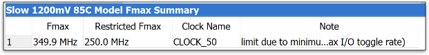
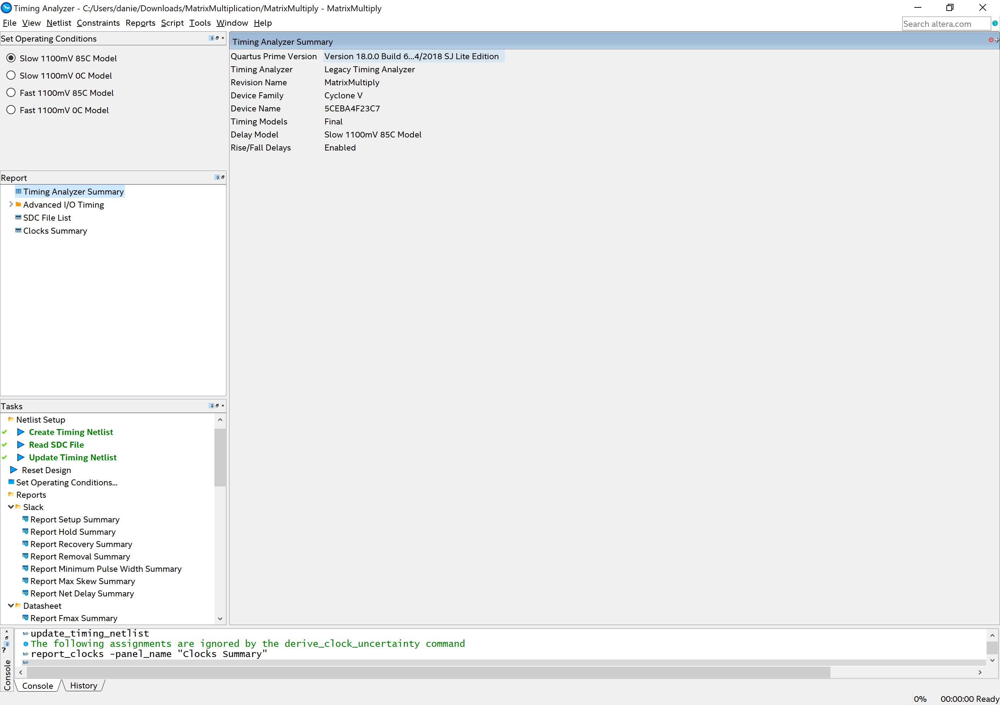
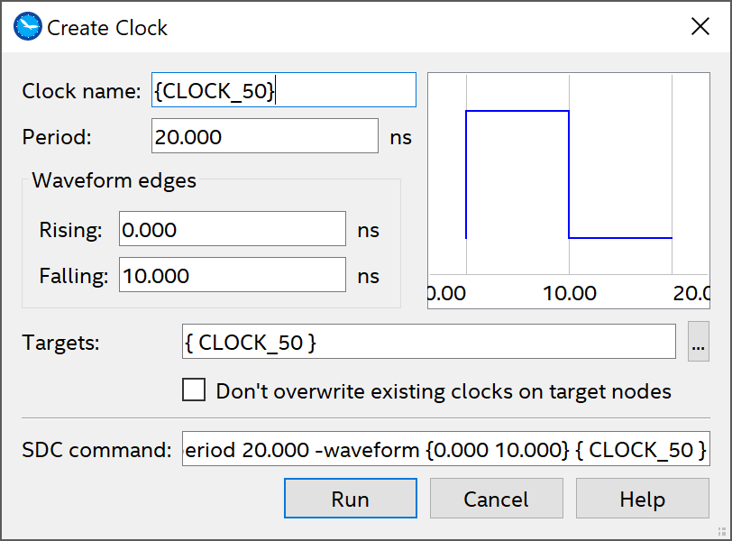
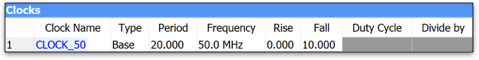

# Matrix Multiply Project

EE4449 - HCMUT

## Objective and Overview

The purpose of this project is to learn to use the special hardware features
available in modern FPGAs. In the past, you've used the CLBs for combinational
and sequential circuitry (though the synthesis tools made it such that you just
worried about getting your `always_comb` and `always_ff` blocks working). In
this project, you'll use hardware
[multiply-accumulate](https://en.wikipedia.org/wiki/Multiply%E2%80%93accumulate_operation)
units and dual-port
[Embedded (Block) RAMs](https://www.altera.com/en_US/pdfs/literature/ug/ug_ram_rom.pdf)
on the FPGA.

This is an **group** project, to be done on your Altera DE10-CV board.

## Schedule and Scoring

If you have not uploaded anything by the dropdead date, we will assume you
are no longer in the course. Why? Because the syllabus says you must attempt
every project. Not uploading anything and not showing up to explain what
you’ve done is not attempting the project — see the syllabus for details.

## A Note about Collaboration

Project 2 is to be accomplished in a group.  All work must be your own.

Hints from others can be of great help, both to the hinter and the hintee.
Thus, discussions and hints about the assignment are encouraged.  However, the
project must be coded and written up in a group (you may not show, nor view,
any source code from other students).  We may use automated tools to detect
copying.

Use Emails/BKEL to ask questions or come visit us (203B3) during office hours.  
We want to see you succeed, but you have to ask for help.

## Project Overview

The problem to solve is the matrix equation

> Y(24-bit) = A(8-bit) * B(8-bit) + C(16-bit)

where **A** is a 128x128 matrix containing 8-bit integers, **B** is a 128x1
column vector containing 8-bit integers, **C** is a 128x1 column vector
containing 16-bit integers, and **Y** is a 128x1 column vector containing 24-bit
integers (why hmm?).  You should treat all values stored in the matrixes as
unsigned integers, but keep in mind that they have different widths (as is
typical for matrix-accumulation operations).  These widths are chosen such that
the intermediate products **should not have any loss of precision.**

In the handout files, we’ll provide you **A**, **B**, and **C**, all of which
are static.  You will include **A**, **B**, and **C** in your design by
downloading them onto the board at configuration time, but your implementation
should work with arbitrary matrices of the same shapes. Your system will perform
the MAC calculation, but rather than have a complicated UI to view
each element of the resulting matrix (**Y**), _your system will simply sum up
all the values in the **Y** matrix and display the resulting 24-bit sum_.

To make this easier to grade, you are to show two different values in the hex
displays.  **SW0** will be used to determine what to show.  If the switch is
`1'b0`, the hex display shows the 24-bit result of the calculation (encoded as
6 hex numerals).  If the switch is `1'b1`, the hex display will show the number
of clock ticks (in hex) needed to execute the computation.  _HINT: you might want
to think about where these bit-widths come from_!

## Timing Analysis

As you may recall from Digital Design, digital signals require a finite amount of time
to propagate through logic, which, in FPGAs, consists of look-up tables (LUTs)
and routing fabric.  Specific timing details of your boards are available in the
manual, but for this project we're mostly interested in the critical path delay
-- essentially a gauge of whether your code will produce a deterministic design.
If the longest path between registers takes >1/70 MHz (i.e. 14.30ns) then your
signals might not arrive in time; alternatively, if the longest path is too
fast, then you might be wasting cycles.  Fortunately, Quartus has a built-in
tool called TimeQuest that will calculate this for you.  In the Tasks pane,
navigate to **Compile Design ➙ Timing Analysis ➙ View Report (double-click)
➙ Slow 1200mV 85C Model ➙ Fmax Summary** and you should see something like this:



The Fmax column is what were interested in.  Keep this value over 70MHz by
breaking up large blobs of combinational logic with registers, and your design
is guaranteed to work "as you coded it."  Let it fall below 70MHz, and all bets
are off.  _HINT: trying to add 8x 16-bit values in a single clock cycle is
probably not going to work :)_.

For this project, your system is required to meet the timing requirements of the
70MHz clock, as shown in that 1200mV, 85C model.

## Timing Constraints

How did Quartus know that your clock was named `CLOCK_50`?  Well, it has some
hints from the inference process (i.e. it sees your `always_ff` blocks are
posedge a signal that you connected to `CLOCK_50`).

If you want to tell Quartus what your clock is, then do the following:

1. Compile your design (just through elaboration is enough).

2. From the home screen, navigate to **Tools ➙ Timing Analyzer** along the top
   toolbar.  You should see a window that looks like the following:
   

2. In the resulting window, use the taskbar on the bottom left to select
   **Tasks ➙ Diagnostic ➙ Report Clocks**.  This will take a few seconds, but
   once it is complete the Timing Analyzer should generate a first-pass report
   for your design.

3. Under **Clocks Summary** you should see an entry for `CLOCK_50`, but it might
   not have the correct constraints for Period, Rise, and Fall times.  You can
   right-click the entries and select **Edit Clock Constraint** to fix the
   values.  If your `CLOCK_50` is not present, you can create it by going to
   **Constraints ➙ Create Clock ...** along the top.  Make sure the values match
   this exactly:
   .

4. Then, assuming everything looks good, go to **Tasks ➙ Write SDC File ...** on
   the bottom-left to generate a constraints file.  You may need to explicitly
   add this file to your Quartus project by going to **Project ➙ Add/Remove
   Files in Project ...** and following the prompts like you would have for any
   new SystemVerilog file.

5. When you re-run the Timing Analyzer as part of the compilation flow in the
   future, it will have a listing for the clock you just created and constrained.
   It may give the same information as before, but now Quartus will be able to
   measure your critical paths accurate and decide if your design is feasible.



## For Credit

You will be graded on getting the right answer to the calculation, on the number
of clock ticks it takes to do the calculation (smaller is better), if it meets
timing, and your coding style.

The number of clock ticks?  Yes, since the chip we have has lots of multiply
units and block RAMs, you can organize the hardware and the **A** and **B**
matrices (and copies of them) so that the calculations can run concurrently.
You can use all of the hardware you want but the question is how fast can you
make it run?  You should count all clock ticks from when reset is no longer
asserted and the calculation starts, until when the result of the calculation is
stored in a register.  After that, the clock tick counter doesn’t increment.

Getting the right answer?  Note that you can organize your data in different
ways to obtain fast implementations.  You can apply some algebraic manipulations
if you think it will be better. And remember, we’re only interested in the final
summation of the **Y** vector.  Actually, due to the limits on displays, we 
actually are only interested in the least significant 24-bits of the **Y** vector.

BTW, you must use the multiply and block RAM special features.  I'm not sure why
you wouldn't, but I've heard reports of student is previous semesters trying to
skip by without learning about the FPGA components.  So sad for them...

Note that we will give a lot of points for just getting it to run.  Getting it
to run faster is worth more, see the grading sheet.  512 clock cycles is
effectively your "speed of light" target, but don't worry if your design is
a bit slower.  Do make sure you're not truncating intermediate values though,
otherwise you might be fast but inaccurate!

## Model Organization

The header for your module should resemble the following:

```systemverilog
module ChipInterface
  (input  logic       CLOCK_50,
   input  logic [9:0] SW,
   input  logic [3:0] KEY,
   output logic [6:0] HEX5, HEX4, HEX3, HEX2, HEX1, HEX0);
```

`BUTTON0`, when depressed, will reset the system.

Develop your code in a file called **matrix_multiply.sv**.  There is really no
TA testbench for this project.  It just runs on the DE10 board and shows its
results.  To do the calculation again, hit reset (you should get the same
result).  That being said, feel free to make your own using the template file [TB](TB.sv)!

The ROMs and multiplier that you will instantiate are detailed below.  The two
matrices (ROMs) are initialized via the *.mif files. We are providing two
different **A**, **B**, and **C** matrices. The **A** matrix is provided in
contiguous row-major order.

* [matA_1.mif](matA_1.mif), [matB_1.mif](matB_1.mif), [matC_1.mif](matC_1.mif)
  will produce the result **24'h206D3D**.

* [matA_2.mif](matA_2.mif), [matB_2.mif](matB_2.mif), [matC_2.mif](matC_2.mif)
  will produce the result **24'h9409CF**.

To use these, copy one set (e.g., all *_1.mif, or all *_2.mif) files to
**matA.mif**, **matB.mif**, and **matC.mif** files and use the Makefile as
specified below. The result given above is what you should expect to see if
you’ve done the calculations correctly.

We have also provided a python script [generate_matrix.py](generate_matrix.py),
which you can use to generate a random problem if you like (it even prints out
the answer).  We will be grading you with a random problem generated from this
python program.

```sh
$ python generate_matrix.py matA_gen.mif matB_gen.mif matC_gen.mif

Matrix files created: matA_gem.mif matB_gen.mif matC_gen.mif
Accumulated product: 0x89779d
```

To make use of the Block RAM and embedded multipliers, instantiate, connect and
use the according to the modules listed below.  If you deviate too much from
these, then the synthesis tool won't recognize that you want the component and
will do something else entirely.

Here are the headers of the component modules in a somewhat cleaned up format.
We have provided these in [romA_128x128.sv](romA_128x128.sv),
[romB_128x1.sv](romB_128x1.sv), [romC_128x1.sv](romC_128x1.sv), and
[multiplier_8816.sv](multiplier_8816.sv) files.  I wouldn't recommend modifying
those files, but feel free to look around inside.

```systemverilog
module romA_128x128
 (input  logic [13:0] address_a, address_b,
  input  tri1         clock,  // I don't know why this is tri1
  output logic [7:0]  q_a, q_b);

// lots of generated code.  Don't touch!

endmodule : romA_128x128

module romB_128x1
  (input  logic [6:0] address_a, address_b,
   input  tri1        clock,  // Still no clue
   output logic [7:0] q_a, q_b);

... // lots of generated code.  Don't touch!

endmodule : romB_128x1

module romC_128x1
  (input  logic [6:0] address_a, address_b,
   input  tri1        clock,  // Still no clue
   output logic [15:0] q_a, q_b);

... // lots of generated code.  Don't touch!

endmodule : romC_128x1
```

**romA_128x128** contains 16384 one-byte wide elements, hence the 14 bit address lines.
**romB_128x1** contains 128 one-byte wide elements, hence 7 bits for address lines.
**romC_128x1** contains 128 two-byte wide elements, hence 7 bits for address lines.

The ROMs are dual ported and thus you can provide two addresses and read two
elements simultaneously.  **address_a** address line provides the data read on
**q_a**. The same is true for **address_b** and **q_b**.

The ROMs have registered inputs but **unregistered** outputs, meaning that the
ROM loads the address values into its own internal registers at each clock edge.
The results read from the ROM appear on **q_a** and **q_b** after that clock
edge.  So, you present the addresses in one state and read the results in the
next.

The data in **romA_128x128** is defined by **romA.mif**, **romB_128x1** data is
defined by **romB.mif**, and finally **romC_128x1** data is defined by
**romC.mif**.  By specifying values for the ROM data, the on-chip implementation
of the ROMs will be initialized to these values.  See the note above about the
two different sets of **A**, **B**, and **C** we have provided.

Hardware usage on the chip: **romA_128x128** uses 16x M10K Embedded RAMs,
**romB_128x1** uses 1x M10K Embedded RAM, and **romC_128x1** uses 1x M10K
Embedded RAM.  The Cyclone V chip has a total of 308 such block RAMs.  Kudos if
you can figure out why these are 10K memories instead of 9K (8192 bit) ones :).

The embedded multiplier has a module header that looks like:

```systemverilog
module multiplier_8816
  (input  logic [7:0]  dataa, datab,
   output logic [15:0] result);

... // lots of generated code.  Don't touch!

endmodule : multiplier_8816
```

This is a byte multiplier that produces a 16-bit result.  Simply connect the two
operands into **dataa** and **datab**, and then patiently wait for the result to
show up on result output _combinationally_.

Hardware usage on the chip: the above uses 1 9x9 multiplier. The 5CEBA4F23C7N
Cyclone V chip has 198 such (independent) multipliers.

## Simulating with QuestaSim

If you want to debug your design, you're not going to have any fun sitting in
the lab synthesizing and downloading again and again.  The modules that tell
Quartus to use the special hardware units (like the roms and multiplier)
conveniently come with functional models that can be used in simulation.  We've
provided a [simlib](simlib) folder  that include all of the Altera's functional models **.sv** files in your directory.  
To simulate, simply run the QuestaSim project with these file included and compile. In fact, the folder [mds]](mds) already included an example project.

QuestaSim may print some “Too few instance port connections” warnings from a file
called **altera_lnsim.sv**. You can safely ignore these warnings.

## Synthesizing with Quartus

If starting a new project, create a directory for the project.  In this
directory, place:

* romA_128x128.v
* romB_128x1.v
* romC_128x1.v
* multiplier_8816.v
* matA.mif
* matB.mif
* matC.mif

Start a project in Quartus with the Project Wizard.  When prompted to add files
to the project, add **romA_128x128.v**, **romB_128x1.v**, **romC_128x1.v** and
**multiplier_8816.v**.

If a project already exists (like if you want to swap *.mif files), then in the
Project Navigator window, switch to the **Files** tab. Right click on **Files**
and click **Add/Remove Files in Project**.

Include a [DE10_Standard_Pin_Assignment](DE10_Standard_Pin_Assignment.qsf) file to connect your pins.

## Some Other Things you Should Learn

In the last project, I introduced you to the DE10 User Manual.  That manual isn't
as useful for this project, as we are trying to use components that aren't part
of the board, but are part of the FPGA itself.  Therefore, you should get to
know a different manual — the Cyclone V Device Handbook.  This manual is found
on [https://intel.com] or on the DVD in the box (though the DVD has an earlier
version, I haven't found any issues with it).  I have also posted a copy on
BKeL.  The manual describes, in great detail, everything that happens inside
the FPGA.  If you wanted to know how big the LUTs in the CLBs were, this is the
document (chapter 2).  If you wanted to know how the multipliers work ("hmm.
I wonder if the multiplier can work on signed values?") this is the document
(chapter 5, in table 5-3).  If you wanted to know how the memory blocks work
("hmm. I wonder if they support dual-port mode?") this is the document (chapter
4, page 4-8).

Please take a few minutes to skim through the Cyclone V Device Handbook.

You should be using `generate` statements to instantiate (almost) all those
embedded memories and multipliers. Because there will be a lot. A LOT.

## How To Turn In Your Solution

This semester we will be using BKeL, simply submit the zip file with your reports and codes.

## Demos and Late Penalty

We will have demo times outside of class times on or near the due date.  Since
we will demo from the files in your zip, it is possible that you’ll demo on a
following day.

**Define Late:**  Lateness is determined by the file dates of your submission on BKeL.
