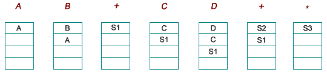
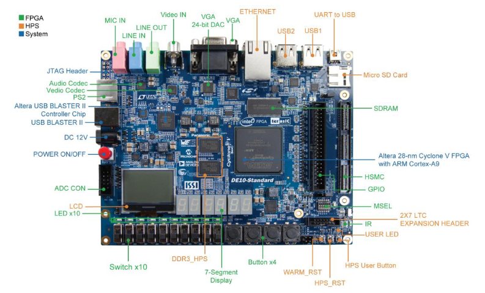

# Lab 4 - Hey! Let's make a 4-bit RPN Calculator
EE4449 - HCMUT

## Objective and Overview

The purpose of this project is to use what we have learn in previous lab to make something fun. I will let you decide most of the specification in this project. We are going to make a Reverse Polish notation calculator.
Read more about it here:

https://en.wikipedia.org/wiki/Reverse_Polish_notation

This is an **group** project, to be done on your Altera DE10 board.

## Schedule and Scoring

If you have not uploaded anything by the dropdead date, we will assume you
are no longer in the course. Why? Because the syllabus says you must attempt
every project. Not uploading anything and not showing up to explain what
you’ve done is not attempting the project — see the syllabus for details.

## A Note about Collaboration

Project 4 is to be accomplished in a group.  All work must be your own.

Hints from others can be of great help, both to the hinter and the hintee.
Thus, discussions and hints about the assignment are encouraged.  However, the
project must be coded and written up in a group (you may not show, nor view,
any source code from other students).  We may use automated tools to detect
copying.

Use Emails/BKEL to ask questions or come visit us (203B3) during office hours.  
We want to see you succeed, but you have to ask for help.

## Project Overview

I will not write much this time. Just want to tell you what you need to do.

An RPN Calculator is not something new, you have use it since your Secondary?! Every calculators that has a C(clear) button, input as pressing a number then press "+ -" then press another number then press "=" is this RPN Calculator.

Reverse Polish Notation (RPN) is a notation for representing arithmetic formula. The common notations that we are familiar with had the operator placed in between the two operands (called the infix notation), for example, A + B, A * B, A + B + C. The RPN notation (or postfix notation) places the operator at the end of the operands, for example, A B +, A B *, A B + C +. The RPN notation has the advantage that it can express operation precedence without using parentheses. For example,

Expression in infix notation: (A + B) * (C + D)

Same expression in postfix notation: A B + C D + *

RPN has been popularized in calculators made by HP. A stack implementation is typically used to evaluate an expression in RPN. For example, to calculate A B + C D + *

Scanning the RPN expression from left to right

If it is an operand, it is pushed onto the stack.
If it is an operator, the top two items on the stack are popped and evaluated with the operator; the result is pushed back onto the stack.

S1 = A + B

S2 = C + D

S3 = S1 * S2

But the orignal calculator has a translator, because RPN works like this. "3 4 5 + - =" is "3 + 4 - 5 =". So you need to make that translator too.

The real calculators has buttons, DE10 has buttons but much less. So let's improvise an interface.

- KEY0 is **Reset/Clear**
- KEY1 is **Input**
- SW0 to SW3 is recognize as follows when you press the **Input** button.

|     Binary  |     Value |     Binary  |     Value |     Binary  |     Value |     Binary  |     Value    |
|-------------|-----------|-------------|-----------|-------------|-----------|-------------|--------------|
|        0000 |        0  |        0100 |        4  |        1000 | 8         |        1100 | NULL         |
|        0001 |        1  |        0101 |        5  |        1001 | 9         |        1101 | NULL         |
|        0010 |        2  |        0110 |        6  |        1010 | "+"       |        1110 | "="          |
|        0011 |        3  |        0111 |        7  |        1011 | "-"       |        1111 |        NULL  |

- The 7segments LED HEX0 to HEX5 will display the number you JUST input (after you press the input). It should not display "+,-" or "=". After you input "=" it will display the result.

For example, I want to calculate 99 + 102 = ? I will press the following buttons:
-   SW[3:0] = 1001 (9) and press KEY1 (Display: 9)
-   SW[3:0] = 1001 (9) and press KEY1 (Display: 99)
-   SW[3:0] = 1010 (+) and press KEY1 (Display: 99)
-   SW[3:0] = 0001 (1) and press KEY1 (Display: 1)
-   SW[3:0] = 0000 (0) and press KEY1 (Display: 10)
-   SW[3:0] = 0010 (2) and press KEY1 (Display: 102)
-   SW[3:0] = 1110 (=) and press KEY1 (Display: 201)

For the easiness of the project, you can assume that the result will not be negative. There are at max 2 operation and 3 numbers. The input number will not be more than 2 digits.

- The LEDR0 will light when it's showing the result.
- The LEDR1 will light when you input something illegal like "999" or a "NULL" command.

## For Credit

You will be graded mostly on the aspect that your design complete the lab, work in simulation and work on the kit.

## Some Other Things you Should Learn

I made this a little bit easier for you. There are only addition and substration. The point is that you understand RPN and know how it works.
It stacks input and command into the **stack** module I have given you in **stack.sv** and process them one by one. You can use this method to make a calculator with more functions in **Lab5**. Write your own FSM in the reports.

## How To Turn In Your Solution

This semester we will be using BKeL, simply submit the zip file with your reports and codes.

## Demos and Late Penalty

We will have demo times outside of class times on or near the due date.  Since
we will demo from the files in your zip, it is possible that you’ll demo on a
following day.

**Define Late:**  Lateness is determined by the file dates of your submission on BKeL.
